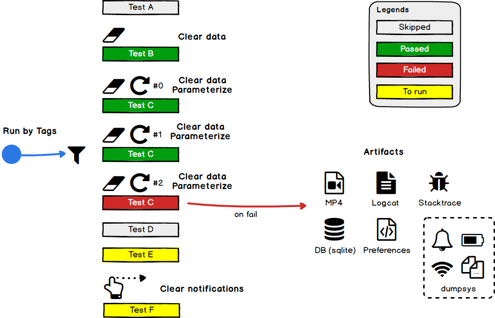
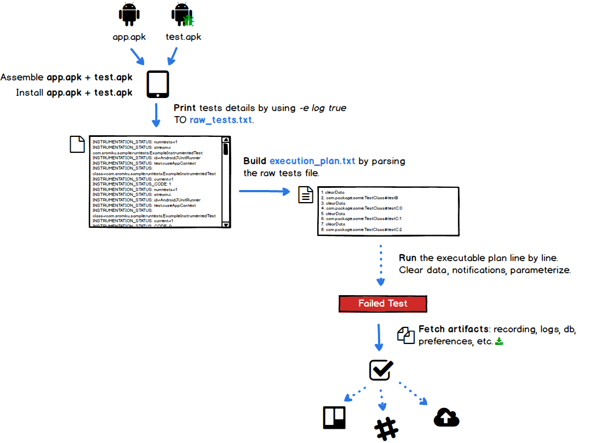
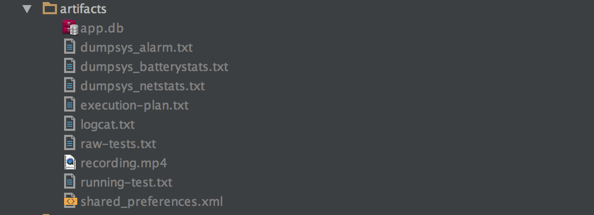

# Running Android UI Tests

Follow this blog post: https://www.sromku.com/blog/run-android-ui-tests

### Running tests



### Test Options
We write UI tests same as before. But now, we can add more annotations that will give us more options. 

- `@ClearData` — Clear data via ADB before test execution.
- `@Repeat` — Repeat the same test X number of times, when current iteration is passed to the test.
- `@Tags` — You can tag your tests. Later, you can run tests by selected tags only.
- `@ClearNotifications` — Clear notification bar via ADB before running the test.

### Test example

```java
@RunWith(AndroidJUnit4.class)
public class ExampleInstrumentedTest {

    @Rule
    public IntentsTestRule<MainActivity> mActivity = new IntentsTestRule<>(MainActivity.class);
        
    private final String[] params = new String[]{
            "a", "A", "Aa"
    };

    @Test
    @ClearData
    @Parameterized.Repeat(count = 3)
    @Tags(tags = {"sanity", "small", "sample"})
    public void someTest() throws Exception {
        String param = params[Parameterized.getIndex()];
        assertEquals("a", param.toLowerCase());
    }
}
```

### Artifacts

In addition to new added options, after each failed test, we fetching and building useful files that will help us investigate failed issues better.

- Recording (mp4)
- Logs
- DB (sqlite)
- Shared preferences
- Dumpsys — Netstats, battery, other.

### Flow



### Run this sample

> Note: <br>
1. Use real device. <br>
2. Works for me on Mac and Ubuntu VM (part of CI). 

```bash
# ---- assemble and install the app + test apks ----
# build app APK
./gradlew assembleDebug --stacktrace
# build test APK
./gradlew assembleAndroidTest --stacktrace
# install app APK
adb install -r app/build/outputs/apk/app-debug.apk
# install test APK
adb install -r app/build/outputs/apk/app-debug-androidTest.apk

# ---- prepare and run the tests ----
# create tests raw file
./scripts/raw.sh artifacts/raw-tests.txt
# build execution plan and filter by tags
./scripts/plan.sh artifacts/raw-tests.txt artifacts/execution-plan.txt -t "sanity,small"
# run the tests
./scripts/run.sh artifacts/execution-plan.txt artifacts
```

You will fail on one of tests :x:. Now go and check the **artifacts** :white_check_mark: folder :wink:



### Explanation + Details

Step by step details on this blog post: https://www.sromku.com/blog/run-android-ui-tests

1. Building Execution Plan
2. Collect Logs, Record Video, Dump DB, Shared Preferences
3. Add ‘Clear data’ support
4. Add ‘Clear notifications’ support
5. Add parameterized support
6. Run tests by #tags
7. Dump network stats, battery, alarms and more.
8. All together

### License
Apache 2.0

### Diagrams
Diagrams are done with [balsamiq](https://balsamiq.com/)
