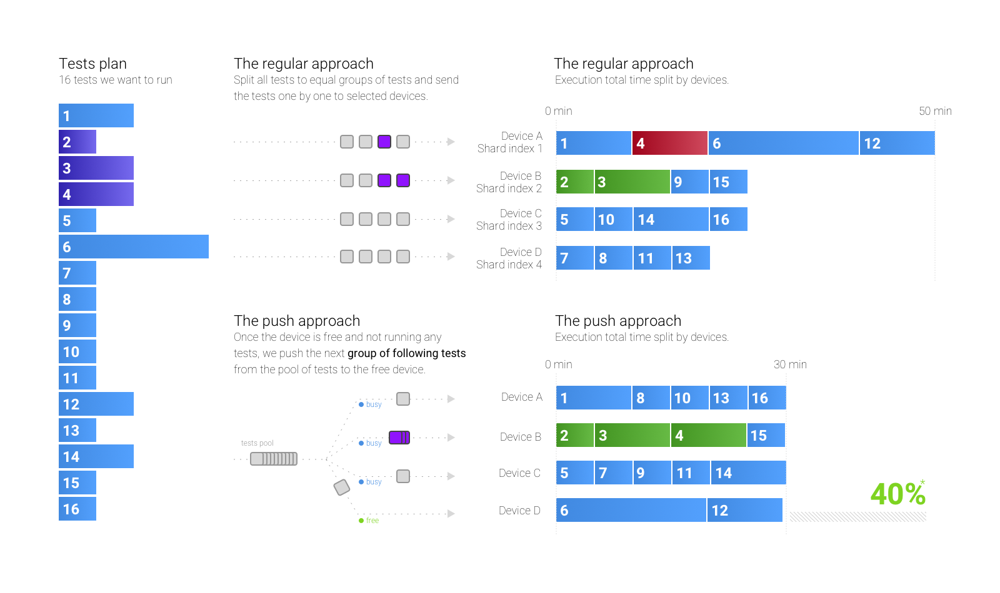

# Grouping following tests

📗 The blog post: https://medium.com/medisafe-tech-blog/running-android-ui-tests-part-2-15ef08056d94



**For example**: We set tests number 2,3 and 4 to be sequential. This means that test number 3 can successfully run only if test number 2 passes. Same for test number 4 that is following test number 3.

If we run the regular way, the tests will be split randomly between shards. In this example, luckily tests number 2 and 3 are running on the same device while unluckily test **4 will always fail! :(**.

#### Setup the tests

Before comparing and running tests make sure to install a sample app and test APKs.<br>
Check the [com.sromku.sample.runtests.follow](https://github.com/medisafe/run-android-tests/tree/master/app/src/androidTest/java/com/sromku/sample/runtests/follow) package to see the written tests and used annotations.

```
# ---- assemble and install the app + test apks ----
# build app APK
./gradlew assembleDebug --stacktrace

# build test APK
./gradlew assembleAndroidTest --stacktrace

# install app APK
adb install -r app/build/outputs/apk/app-debug.apk

# install test APK
adb install -r app/build/outputs/apk/app-debug-androidTest.apk
```

#### Set the devices

- 2+ emulators/devices

#### Run

```
# dump tests to raw file
./scripts/9/raw.sh artifacts/raw-tests.txt

# build a plan
./scripts/9/plan.sh artifacts/raw-tests.txt artifacts/plan-tests.txt

# run tests in parallel on all connected devices & emulators
./scripts/9/run-shard.sh artifacts/plan-tests.txt artifacts
```

#### The plan

If you open the `artifacts/plan-tests.txt` you will see 4 groups of tests: 

```
~~~
clearData
com.sromku.sample.runtests.follow.FollowOne#testA
com.sromku.sample.runtests.follow.FollowOne#testB
~~~
clearData
com.sromku.sample.runtests.follow.FollowOne#testC
clearData
com.sromku.sample.runtests.follow.FollowOne#testD
com.sromku.sample.runtests.follow.FollowOne#testE
~~~
com.sromku.sample.runtests.follow.FollowTwo#testA
~~~
clearData
com.sromku.sample.runtests.follow.FollowTwo#testB
com.sromku.sample.runtests.follow.FollowTwo#testC
TOTAL_TESTS=8
TOTAL_TEST_GROUPS=4
```

Some of the groups have more than one tests. This means that the tests have `@Following` annotations and those groups will be executed on the same device when we run all our tests in parallel on multiple devices.


