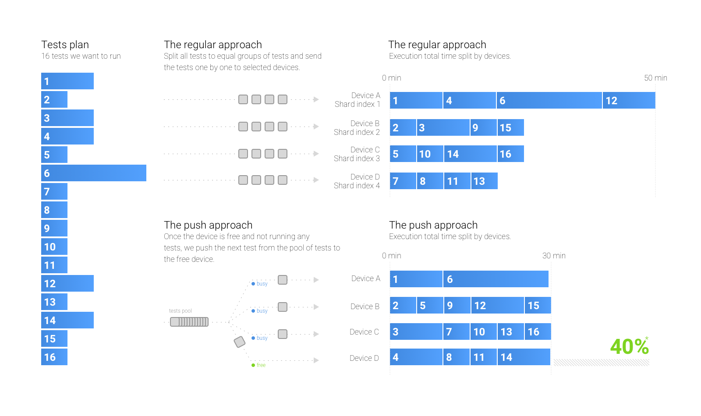

# Parallel — The regular approach vs. push approach

📗 The blog post: https://medium.com/medisafe-tech-blog/running-android-ui-tests-part-2-15ef08056d94



#### Setup the tests

Before comparing and running tests make sure to install a sample app and test APKs.

```
# ---- assemble and install the app + test apks ----
# build app APK
./gradlew assembleDebug --stacktrace

# build test APK
./gradlew assembleAndroidTest --stacktrace

# install app APK
adb install -r app/build/outputs/apk/app-debug.apk

# install test APK
adb install -r app/build/outputs/apk/app-debug-androidTest.apk
```

#### Set the devices

- 40 tests
- 4 emulators/devices

#### Run the regular way

Change the {device} to one of the connected device names you have. (Run `adb devices` to see them).

```
# run shard 0
adb -s {device} shell am instrument -w -r -e package com.sromku.sample.runtests.shard -e numShards 4 -e shardIndex 0 com.sromku.sample.runtests.test/android.support.test.runner.AndroidJUnitRunner

# run shard 1
adb -s {device} shell am instrument -w -r -e package com.sromku.sample.runtests.shard -e numShards 4 -e shardIndex 1 com.sromku.sample.runtests.test/android.support.test.runner.AndroidJUnitRunner

# run shard 2
adb -s {device} shell am instrument -w -r -e package com.sromku.sample.runtests.shard -e numShards 4 -e shardIndex 2 com.sromku.sample.runtests.test/android.support.test.runner.AndroidJUnitRunner

# run shard 3
adb -s {device} shell am instrument -w -r -e package com.sromku.sample.runtests.shard -e numShards 4 -e shardIndex 3 com.sromku.sample.runtests.test/android.support.test.runner.AndroidJUnitRunner
```

#### Run the push approach

```
# dump tests to raw file
./scripts/8/raw.sh artifacts/raw-tests.txt

# build a plan
./scripts/8/plan.sh artifacts/raw-tests.txt artifacts/plan-tests.txt

# run tests in parallel on all connected devices & emulators
./scripts/8/run-shard.sh artifacts/plan-tests.txt artifacts
```

#### Raw results

In our case we are using: 4 emulators - Nexus 5x API 25

**Test / Device and time in both ways**

|         |           |           |   | Regular way |                |   | Parallel way |                |
|---------|-----------|-----------|---|-------------|----------------|---|--------------|----------------|
| Class   | Test name | Test size |   | Device #    | Test execution |   | Device #     | Time execution |
| class A | A         | small     |   | 4           | 10.28          |   | 1            | 11.50          |
|         | B         | large     |   | 1           | 30.29          |   | 2            | 31.87          |
|         | C         | small     |   | 2           | 10.28          |   | 3            | 12.67          |
|         | D         | small     |   | 3           | 10.28          |   | 4            | 12.08          |
|         | E         | small     |   | 4           | 10.28          |   | 1            | 11.29          |
|         | F         | large     |   | 1           | 30.29          |   | 4            | 31.61          |
|         | G         | small     |   | 2           | 10.28          |   | 3            | 12.74          |
|         | H         | small     |   | 3           | 10.28          |   | 1            | 11.31          |
|         | I         | small     |   | 4           | 10.28          |   | 3            | 12.68          |
|         | J         | large     |   | 1           | 30.29          |   | 2            | 31.65          |
| class B | A         | large     |   | 1           | 30.29          |   | 1            | 31.45          |
|         | B         | small     |   | 2           | 10.28          |   | 3            | 12.66          |
|         | C         | small     |   | 3           | 10.28          |   | 4            | 11.47          |
|         | D         | small     |   | 4           | 10.28          |   | 3            | 12.79          |
|         | E         | large     |   | 1           | 30.29          |   | 4            | 31.57          |
|         | F         | small     |   | 2           | 10.28          |   | 2            | 11.39          |
|         | G         | small     |   | 3           | 10.28          |   | 3            | 12.69          |
|         | H         | small     |   | 4           | 10.28          |   | 1            | 11.22          |
|         | I         | large     |   | 1           | 30.29          |   | 2            | 31.37          |
|         | J         | small     |   | 2           | 10.28          |   | 3            | 12.72          |
| class C | A         | small     |   | 2           | 10.28          |   | 1            | 11.20          |
|         | B         | small     |   | 3           | 10.28          |   | 4            | 11.53          |
|         | C         | small     |   | 4           | 10.28          |   | 1            | 11.34          |
|         | D         | large     |   | 1           | 30.29          |   | 3            | 32.68          |
|         | E         | small     |   | 2           | 10.28          |   | 4            | 11.51          |
|         | F         | small     |   | 3           | 10.28          |   | 1            | 11.34          |
|         | G         | small     |   | 4           | 10.28          |   | 2            | 11.46          |
|         | H         | large     |   | 1           | 30.29          |   | 4            | 31.50          |
|         | I         | small     |   | 2           | 10.28          |   | 1            | 11.21          |
|         | J         | small     |   | 3           | 10.28          |   | 2            | 11.56          |
| class D | A         | small     |   | 3           | 10.28          |   | 3            | 12.82          |
|         | B         | small     |   | 4           | 10.28          |   | 1            | 11.14          |
|         | C         | large     |   | 1           | 30.29          |   | 2            | 31.42          |
|         | D         | small     |   | 2           | 10.28          |   | 1            | 11.34          |
|         | E         | small     |   | 3           | 10.28          |   | 3            | 12.69          |
|         | F         | small     |   | 4           | 10.28          |   | 4            | 11.56          |
|         | G         | large     |   | 1           | 30.29          |   | 1            | 31.07          |
|         | H         | small     |   | 2           | 10.28          |   | 3            | 12.72          |
|         | I         | small     |   | 3           | 10.28          |   | 4            | 11.60          |
|         | J         | small     |   | 4           | 10.28          |   | 2            | 11.53          |

**Total times**

| Regular way |            |             |   | Parallel way |            |             |
|-------------|------------|-------------|---|--------------|------------|-------------|
| Device #    | Total time | Total tests |   | Device #     | Total time | Total tests |
| 1           | 302.90     | 10          |   | 1            | 175.40     | 12          |
| 2           | 102.80     | 10          |   | 2            | 172.24     | 8           |
| 3           | 102.80     | 10          |   | 3            | 159.86     | 11          |
| 4           | 102.80     | 10          |   | 4            | 164.41     | 9           |

**Summary**

Regular way:
- Max time: `302.90`

Push way:
- Max time: `175.40` 


**Conclusion**

The time execution improvement of **42%** ❗
